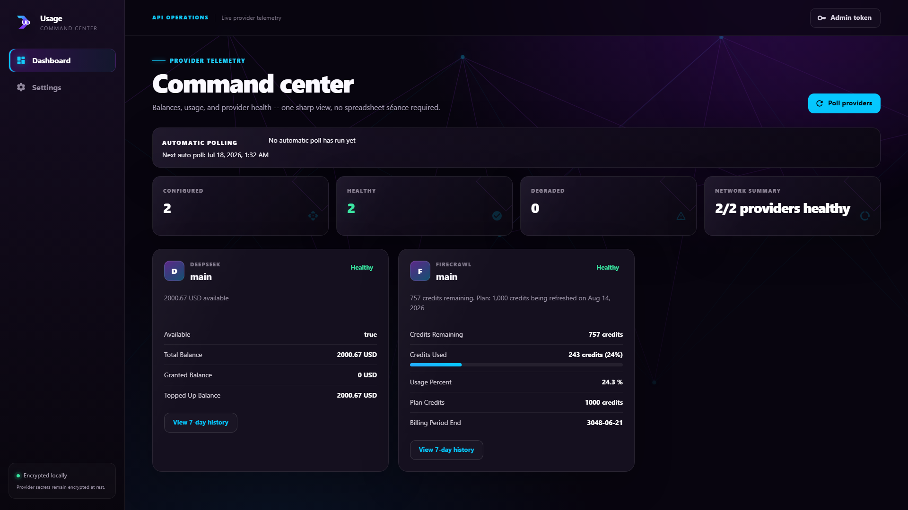

<p align="center"></p>

# Usage Dashboard

Self-hosted API usage dashboard for Firecrawl, DeepSeek, OpenAI, Anthropic/Claude, OpenRouter, OpenAI Codex, OpenCode Go, and custom HTTP usage endpoints. It stores provider credentials encrypted at rest, polls usage/balance APIs, renders a dark React/MUI dashboard, and exposes a flat Homepage Dashboard endpoint.

<p align="center">
  <a href="https://ko-fi.com/skulldorom"></a>
</p>



## Documentation

Full documentation - installation, configuration, providers, integrations, the browser extension, and development - lives in the [documentation site](https://skulldorom.github.io/usage-dashboard/docs/).

## Quick start

Start from a machine with Git and Docker Compose installed. This path uses the published containers, so you do not need to build anything locally.

```bash
git clone https://github.com/Skulldorom/usage-dashboard.git
cd usage-dashboard
cp .env.example .env
openssl rand -base64 32 | tr '+/' '-_'
```

Copy the generated value into `ENCRYPTION_KEY` in `.env`, replacing `replace-with-generated-fernet-key`. Then start the stack:

```bash
docker compose pull
docker compose up -d
docker compose logs backend
```

Open the frontend, then use the one-time setup code from the backend logs to create the admin password.

- Frontend: http://localhost:3000
- Backend health: http://localhost:3000/health

See [First-run setup](https://skulldorom.github.io/usage-dashboard/docs/getting-started/first-run.html) for the setup-code flow in more detail.

## Features

- 🔐 Provider credentials encrypted at rest with Fernet.
- 📊 Usage and balance tracking for eight provider types.
- 🏠 Homepage Dashboard widget with dynamic per-provider rows.
- 🧩 Chrome/Brave browser extension with one-click setup.
- 🔔 Alert thresholds and automatic background polling.

## Stack

- Backend: FastAPI, SQLAlchemy async, asyncpg, Alembic, cryptography/Fernet
- Frontend: Vite, React, MUI, React Router
- Runtime: PostgreSQL, nginx-based frontend/proxy image, Docker Compose

## Development

See the [documentation site](https://skulldorom.github.io/usage-dashboard/docs/development/local-development.html) for local development, testing, and Docker image build instructions.

## License

[Mozilla Public License 2.0](LICENSE)
